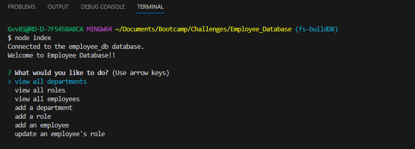

# Employee_Database

## Description

I wanted to find a better way of collecting and storeing big amounts of data instead of just using a json file. Mysql happens to be a popular language or software to accomplish this task. I have been studying mysql and incorparating it into my projects. Employee Database is my first project using mysql. Employee Database should be able to let users make a database with information on their current employees'. There is a schema file to build the tables in the database and a seeds file to include the current employees'. While using this program you can easily look at all of your current employees' information without having to enter in msql shell. I have expanded my knowledge on mysql. Concepts like join, foriegn keys, constraints, and aggregate functions that are avalible within mysql.

## Installation

Now to run this project you will need to install nodejs. I will include the link to get nodejs below. When downloading nodejs just make sure you get the proper version for your device.
 
Nodejs Installation Link: https://nodejs.org/en/download
 
After installing nodejs you will need to install mysql on your own device and make a password for your mysql account. The link below will lead you to the mysql download page.
 
Installation Link: https://dev.mysql.com/downloads/mysql/
 
Then once you have that you will need to install mysql2 and inquirer libraries for this project. I should have the correct libraries already in the package.json file, so all you need to do is enter in the following command in your terminal at the project folder location.
 
    npm install
 
If the previous command does not work you can use this other command to install mysql and the second command to install inquirer.
 
    npm install mysql2
 
    npm install inquirer inquirer@8.2.4
 

## Usage

To use this employee database you will need to have your own mysql account. Users will need to log into their mysql account to run the schema.sql and seeds.sql in the mysql shell to make the employee database. After making your database users will need to add their mysql password into the cli.js file to access the database. Then at that point you can run the index.js file to get to the terminal prompt options to get information from the employeedatabase.

The image above will show the prompts the project will display to users amd picking one of the options will either give us data, add data, or alter data in the employee database.

The image above shows what is returned in a get table request.
 

The image shown is showing what is asked to make a new role. One thing to mention here is that there is no data validation in the input entered, so users can enter anything in for input including empty spaces.
 
 

Similar to the previous image, but we are making a new employee this time. Again there is no data validation in the inputs.
 

The last image above is showning the last option of updating an employee's role.
 
Here is a demo video link of Project: https://drive.google.com/file/d/1IUAcQUJdDwnMUNjJb9ExcrjMs9KSkD52/view

## Credits

Thank you to nodejs, mysql, mdn web docs, inquirer, and mysql2
 
Nodejs is the main server running mnd compiling my code
 
mysql to all the documentation on your software.
 
Link to documentation: https://dev.mysql.com/doc/refman/8.0/en/introduction.html
 
Thank you mdn web docs for providing general information on accessing objects and arrarys in javascript
 
Thanks to inquirer to letting me use your library to send prompts
 
thanks to mysql2 for letting me include mysql queries into my javascript without having to go into the mysql shell terminal.

## License

The project is covered by the MIT license. Please refer to the repo for more information on the license. The link below we will link users to the template followed to make license.

License Link: https://spdx.org/licenses/MIT.html

## Badges

## Tests

N/A

## Questions

Any questions you may have you can contact me through my email shown below and there is a link to my github account.

Email: gvv8106@gmail.com

GitHub Profile: https://github.com/Giovanne-Villanueva